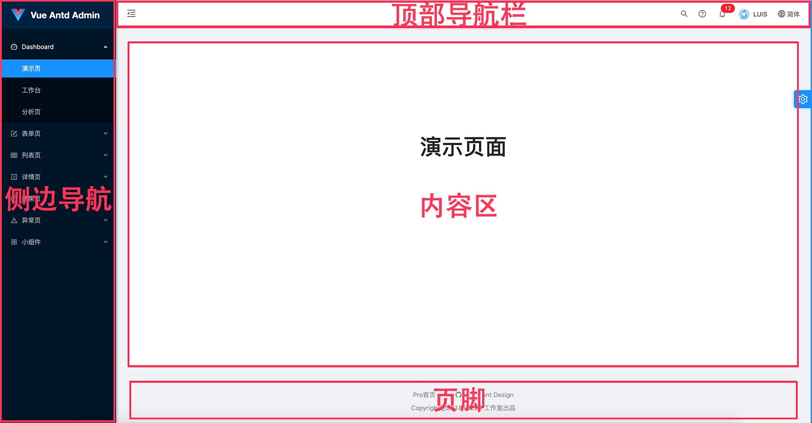
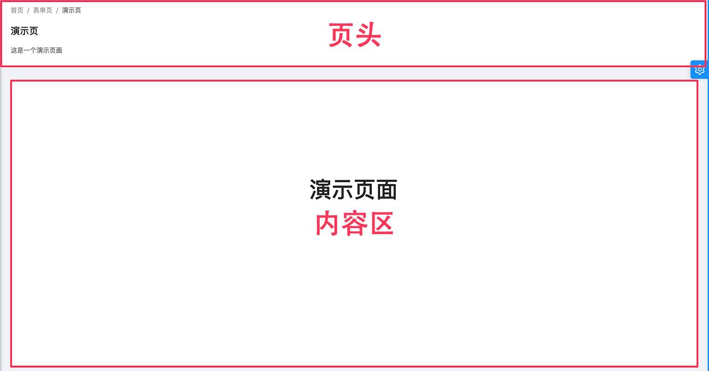
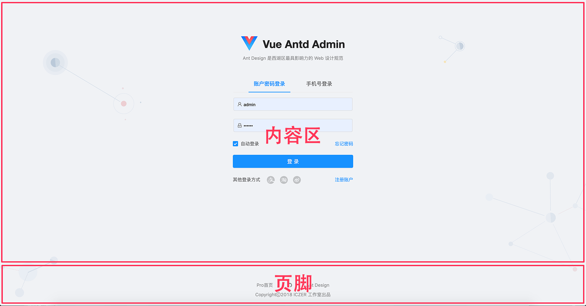
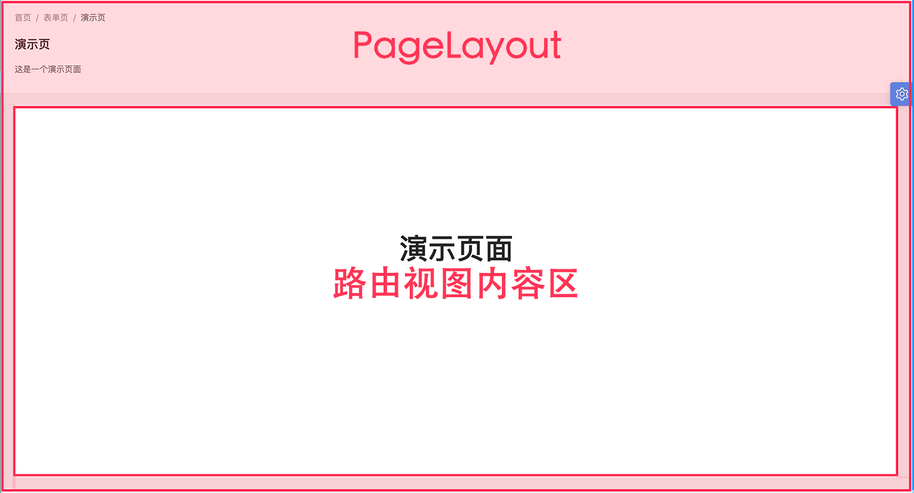

# 布局
页面整体布局是一个产品最外层的框架结构，往往会包含导航、页脚、侧边栏、通知栏以及内容等。在页面之中，也有很多区块的布局结构。在真实项目中，页面布局通常统领整个应用的界面，有非常重要的作用。

## Admin 的布局
在 Vue Antd Admin 中，我们抽离了使用过程中一些常用的布局，都放在 layouts 目录中，分别为：
* [AdminLayout](https://github.com/iczer/vue-antd-admin/blob/master/src/layouts/AdminLayout.vue) / **管理后台布局**，包含了头部导航，侧边导航、内容区和页脚，一般用于后台系统的整体布局


* [PageLayout](https://github.com/iczer/vue-antd-admin/blob/master/src/layouts/PageLayout.vue) / **页面布局**，包含了页头和内容区，常用于需要页头（包含面包屑、标题、额外操作等）的页面


* [CommonLayout](https://github.com/iczer/vue-antd-admin/blob/master/src/layouts/CommonLayout.vue) / **通用布局**，仅包含内容区和页脚的简单布局，项目中常用于注册、登录或展示页面


## Admin 的视图
在 Vue Antd Admin 中，除了基本布局外，通常有很多页面的结构是相似的。因此，我们把这部分结构抽离为视图组件。  
一个视图组件通常包含一个基本布局组件、视图公共区块、路由视图内容区、页脚等，常常结合路由配置使用。它们也被放入了 layouts 目录中，分别为：
* [TabsView](https://github.com/iczer/vue-antd-admin/blob/master/src/layouts/TabsView.vue) / **多页签视图**，包含了 AdminLayout 布局、多页签头和路由视图内容区


* [PageView](https://github.com/iczer/vue-antd-admin/blob/master/src/layouts/PageView.vue) / **页面视图**，包含了 PageLayout 布局和路由视图内容区


* [BlankView](https://github.com/iczer/vue-antd-admin/blob/master/src/layouts/BlankView.vue) / **空白视图**，仅包含一个路由视图内容区


## 如何使用
通常我们会把视图组件和路由配置结合一起使用，我们把配置信息抽离在路由配置文件中 [src/router/config.js](https://github.com/iczer/vue-antd-admin/blob/master/src/router/config.js) 。如下：
```jsx {7,12}
{
  path: 'form',
  name: 'form',
  meta: {
    icon: 'form',
  },
  component: PageView,
  children: [
    {
      path: 'basic',
      name: '基础表单',
      component: () => import('@/pages/form/basic/BasicForm'),
    }
  ]
}
```
当然，如果这满足不了你的需求，你也可以自定义一些视图组件，或者直接在页面组件中使用布局。参考
[workplace](https://github.com/iczer/vue-antd-admin/blob/master/src/pages/dashboard/workplace/WorkPlace.vue) 页面:
```vue {2,13}
<template>
  <page-layout :avatar="currUser.avatar">
    <div slot="headerContent">
      <div class="title">{{$t('timeFix')}}，{{currUser.name}}，{{$t('welcome')}}</div>
      <div>{{$t('position')}}</div>
    </div>
    <template slot="extra">
      <head-info class="split-right" :title="$t('project')" content="56"/>
      <head-info class="split-right" :title="$t('ranking')" content="8/24"/>
      <head-info class="split-right" :title="$t('visit')" content="2,223"/>
    </template>
    <div>...</div>
  </page-layout>
</template>
```
## 其它布局组件
除了 Admin 里的内建布局以外，在一些页面中需要进行布局，还可以使用 Ant Design Vue 提供的布局组件：Grid 和 Layout。
### Grid 组件
栅格布局是网页中最常用的布局，其特点就是按照一定比例划分页面，能够随着屏幕的变化依旧保持比例，从而具有弹性布局的特点。  

而 Ant Design Vue 的栅格组件提供的功能更为强大，能够设置间距、具有支持响应式的比例设置，以及支持 flex 模式，基本上涵盖了大部分的布局场景，详情查看：[Grid](https://www.antdv.com/components/grid-cn/)。
### Layout 组件
如果你需要辅助页面框架级别的布局设计，那么 Layout 则是你最佳的选择，它抽象了大部分框架布局结构，使得只需要填空就可以开发规范专业的页面整体布局，详情查看：[Layout](https://www.antdv.com/components/layout-cn/)。
### 根据不同场景区分抽离布局组件
在大部分场景下，我们需要基于上面两个组件封装一些适用于当下具体业务的组件，包含了通用的导航、侧边栏、顶部通知、页面标题等元素。例如 Vue Antd Admin 的 [AdminLayout](https://github.com/iczer/vue-antd-admin/blob/master/src/layouts/AdminLayout.vue)。  
 
通常，我们会把抽象出来的布局组件，放到 layouts 文件夹中方便管理。需要注意的是，这些布局组件和我们平时使用的其它组件并没有什么不同，只不过功能性上是为了处理布局问题而单独归类。
